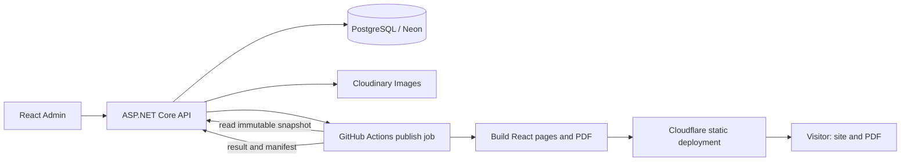
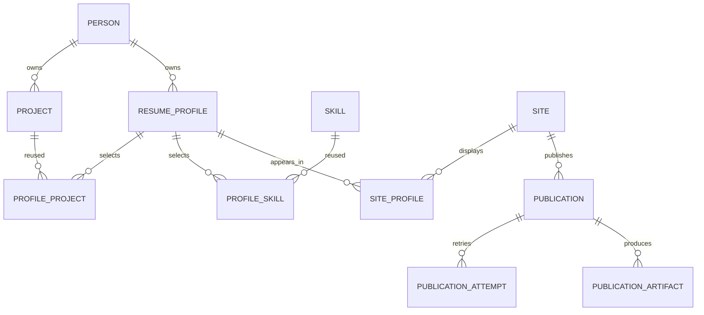

# تحليل المشروع ومواصفات التنفيذ لـTerra

تاريخ الإعداد: 11 سبتمبر 2026. الحالة: مواصفات تنفيذ مقترحة مبنية على قرارات صاحب المشروع، وليست تقريرًا عن نظام مكتمل.

حزمة التسليم تتكون من هذا التحليل، و[مواصفات التصميم](./TERRA_VISUAL_DESIGN_AR.md)، و[مواصفات الهوية وSEO](./TERRA_SEO_IDENTITY_AR.md). على Terra قراءة الملفات الثلاثة؛ ملحق SEO يحدد التفاصيل المكملة للفهرسة والهوية، والتصميم يحدد التكوين المرئي، مع المحافظة على قواعد البيانات واستقلال قالب ATS PDF.

## 1. الهدف والقرارات المعتمدة

بناء منصة شخصية لإدارة وعرض السيرة الذاتية لصاحب المشروع، بهوية مهنية أساسية:

> Software Engineer | Flutter & .NET Backend

التحديث المعتمد من المالك: الهوية الأساسية Software Engineer (مهندس برمجيات)، والتخصص Flutter و.NET Backend. Software Engineering اسم المجال، وSoftware Engineer المسمى الشخصي المستخدم في العرض. تنطبق الهوية على الموقع والسيرة وmetadata وREADME والبيانات الافتراضية، دون تغيير أسماء وظائف تاريخية فعلية أو إضافة درجة Senior أو مؤهل غير مقدم. بروفايلات التقديم تُبرز أحد التخصصين مع بقاء الهوية الأساسية متسقة.

تحتوي المنصة على موقع عام، ولوحة تحكم خاصة، وBackend، وقاعدة بيانات، وآلية نشر وتوليد ملفات Resume PDF بالعربية والإنجليزية. تدعم عدة بروفايلات تستعمل نفس البيانات، مع اختلاف الملخص والمشاريع والمهارات وترتيبها حسب الوظيفة المستهدفة. ويمكن عرضها عبر أكثر من موقع.

قرارات المستخدم الملزمة:

- React لموقع العرض ولوحة التحكم؛ لا Flutter Web ولا Astro في هذا المشروع.
- ASP.NET Core للـBackend.
- استضافة مجانية قدر الإمكان، ضمن حدود الخطط، مع تجهيز الكود للنشر على GitHub.
- إضافة المحتوى وتعديله من لوحة التحكم، دون تعديل الكود في كل مرة.
- أكثر من بروفايل، وPDF عربي أو إنجليزي لكل بروفايل.
- قالب Resume يراعي القراءة الآلية بواسطة أنظمة تتبع المتقدمين ATS.
- عدم اختلاق خبرة وظيفية: المشاريع الحالية شخصية، والخبرة الوظيفية قسم اختياري.

الاختيارات التفصيلية التالية قرارات هندسية مقترحة لـTerra؛ ثبّت الإصدارات المستقرة المتوافقة في ملفات القفل عند التنفيذ. لا تغيّر هذه المعمارية دون توضيح سبب تقني وتوثيقه.

## 2. النطاق

### الإصدار الأول المطلوب

- مالك واحد للنظام، مع تسجيل دخول خاص به، دون تسجيل عام.
- بيانات شخصية وتواصل وتعليم ومهارات ومشاريع وشهادات ولغات وخبرات اختيارية.
- محتوى عربي وإنجليزي مستقل، مع كشف الترجمة الناقصة.
- إنشاء البروفايلات ونسخها وأرشفتها وانتقاء محتواها وترتيبه.
- تحرير النص الموجّه للبروفايل دون تغيير الحقائق المشتركة.
- إدارة عدة مواقع منطقيًا، ولكل موقع روابط وبروفايلات ولغات وإعدادات مستقلة.
- رفع صور المشاريع وإدارتها من لوحة التحكم.
- معاينة الموقع والسيرة، وحفظ المسودات، ونشر نسخة محددة.
- توليد PDF فعلي بالعربية والإنجليزية، وفحصه قبل نشره.
- صفحة مشروع، تنزيل Resume، روابط GitHub وLinkedIn والتواصل.
- نشر آلي، وإظهار حالة التنفيذ والفشل وإعادة المحاولة.
- توثيق وتشغيل محلي وبيانات تجريبية واختبارات ذات معنى.

### مؤجل صراحةً

متجر قوالب، اشتراكات، تعدد مالكي النظام SaaS، تسجيل الزوار، ذكاء اصطناعي لكتابة الإنجازات، ترجمة تلقائية مدفوعة، تقديم آلي للوظائف، تحليلات تتبع تفصيلية، محرر صفحات حر، DOCX، نموذج رسائل وبريد صادر، رفع فيديو، ودومينات تُحجز تلقائيًا. التواصل في البداية بروابط بريد وروابط مهنية. وجود هذه العناصر في قائمة الأفكار لا يجعلها جزءًا من التسليم.

## 3. التقنيات والاستضافة

| الجزء | الاختيار | سبب الاختيار |
|---|---|---|
| Backend | ASP.NET Core 10، C#، REST، OpenAPI | يتوافق مع هوية المشروع والبداية الموجودة |
| الوصول للبيانات | EF Core 10 + Npgsql المتوافق | علاقات واضحة وMigrations وPostgreSQL |
| قاعدة البيانات | PostgreSQL 17 محليًا، إصدار متوافق لدى Neon | بيانات مترابطة وسهولة النقل |
| الموقع العام | React + TypeScript عبر Next.js، بوضع `output: 'export'` | HTML لكل مسار، دون خادم Node دائم |
| لوحة التحكم | React + TypeScript + Vite + React Router | تطبيق إدارة يتصل مباشرة بالـAPI |
| نماذج الإدارة | React Hook Form + Zod | تحقق واضح في الواجهة؛ الخادم يعيد التحقق |
| بيانات الواجهة | TanStack Query | جلب وتحديث وحالات تحميل وأخطاء |
| التنسيق | Tailwind CSS، مكونات متاحة بلوحة المفاتيح | تصميم متجاوب وRTL دون بناء نظام تصميم ضخم |
| PDF | React print template + Playwright Chromium في CI | HTML نصي، دعم طباعة وخطوط عربية، فصل الحمل عن الـAPI |
| اختبار PDF | Poppler: `pdftotext`, `pdffonts`, `pdfinfo`, `pdftoppm` | استخراج النص وفحص الخطوط والصفحات بصريًا |
| اختبارات | xUnit، PostgreSQL integration tests، Vitest، Playwright | تحقق من البيانات والواجهات والنشر |
| Backend hosting | Render Free، Linux Docker | تشغيل ASP.NET Core كحاوية |
| Database hosting | Neon Free | تخزين دائم مستقل عن حاوية Render |
| UI hosting | Cloudflare Pages Free | استضافة ملفات الموقع والإدارة وPDF بعد البناء |
| صور المحتوى | Cloudinary Free، خلف `IMediaStorage` | رفع من الإدارة دون تخزين محلي مؤقت |
| CI/CD | GitHub Actions، standard Ubuntu runner | اختبارات وبناء PDF ونشر الملفات |

Next.js هنا إطار React؛ لا نستخدم Server Actions أو SSR أو Next API runtime. جميع عمليات البيانات والمصادقة وقواعد العمل في .NET. المسارات العامة واللغات تولّد وقت البناء عبر `generateStaticParams`. معالجة الصور ثابتة مسبقًا أو من Cloudinary؛ لا تعتمد على Next image optimizer الذي يحتاج خادمًا. [تصدير Next.js الثابت](https://nextjs.org/docs/app/guides/static-exports)

### حدود الاستضافة التي يجب أن يراعيها Terra

- Render Free ينام بعد 15 دقيقة دون حركة، والاستيقاظ قد يستغرق قرابة دقيقة؛ يمنح 750 ساعة مجانية شهريًا لكل workspace. الملفات المحلية تضيع مع إعادة التشغيل؛ قاعدة Render PostgreSQL المجانية تنتهي بعد 30 يومًا فلا نعتمدها. راجع أيضًا حصص النقل والبناء وإعداد الإنفاق وقت الإعداد. [Render Free](https://render.com/docs/free)
- Neon Free وفق الخطة الحالية: 0.5 GB لكل مشروع، 100 CU-hours شهريًا لكل مشروع، و5 GB نقل عام مشمول. البيانات النصية مناسبة لهذه الحصة؛ لا تخزن الصور أو PDFs بصيغة Base64 داخل قاعدة البيانات. [Neon pricing](https://neon.com/pricing)
- Cloudflare Pages Free: 500 builds شهريًا، 20,000 ملف للموقع، 25 MiB حد الملف. طابق حدود طريقة النشر المستخدمة أيضًا. [Cloudflare Pages limits](https://developers.cloudflare.com/pages/platform/limits/)
- Cloudinary Free يقدم 25 credit مشتركة بين التخزين والتحويلات والنقل، وليست 25 GB مستقلة لكل مورد. ضع حدودًا للرفع والتحويلات. [Cloudinary plans](https://cloudinary.com/documentation/billing_and_plans)
- GitHub Actions مجاني على standard hosted runners في المستودعات العامة ضمن سياسات الاستخدام؛ التخزين والـartifacts لها حدود، وlarger runners ليست مجانية. اجعل retention قصيرًا ولا تسجل المحتوى الخاص. [GitHub Actions billing](https://docs.github.com/en/billing/concepts/product-billing/github-actions)
- النطاق الشخصي اختياري ومدفوع عادة؛ نبدأ بروابط الخدمات المجانية. لا نَعِد باستضافة غير محدودة أو مجانية إلى الأبد.

## 4. المعمارية وتدفق البيانات

Backend واحد منظم إلى طبقات، مع قاعدة واحدة. لا Microservices ولا Redis ولا Message Broker في الإصدار الأول.



الزائر يقرأ الموقع ويحمل PDF دون الاتصال بـRender أو Neon. لا تستعمل fetch من الـAPI لعرض الاسم والملخص والمشاريع عند كل زيارة. لوحة الإدارة تتصل بالـAPI وتوضح تأخر الاستيقاظ دون فقدان البيانات المدخلة.

نفرّق بين:

- `Person`: الحقائق المشتركة لصاحب السيرة.
- `ResumeProfile`: انتقاء المحتوى وترتيبه وصياغته لفرصة معينة.
- `Site`: مكان عرض بروفايل أو عدة بروفايلات مع روابط وإعدادات SEO.
- `Publication`: نسخة محتوى ثابتة، منسوبة إلى عملية نشر أو تصدير محددة.

إنشاء بروفايل Flutter لا يكرر الشخص أو المشاريع. ووجود موقعين لا يعني قاعدتين أو API مختلفين.

## 5. تنظيم المستودع والعمل الموجود

الحالة المرصودة وقت إعداد الوثيقة: Solution وثلاثة مشاريع تستهدف net10.0، وProgram.cs ما زال يحتوي مثال weatherforecast. يوجد Docker Compose لـPostgreSQL 17، لكن healthcheck يستخدم مستخدمًا واسم قاعدة مختلفين عن إعدادات الخدمة. لم يكن الجذر مستودع Git مهيّأ وقت الفحص.

على Terra إعادة الفحص قبل العمل؛ هذه الملاحظات ليست إذنًا لحذف تعديلات أحدث.

```text
my_resume_backend.sln
resume.API/                  endpoints, auth, DI, HTTP contracts
resume.Core/                 entities, invariants, interfaces
resume.Application/          use cases, projection, publish validation
resume.infrastructure/       EF Core, media, GitHub integration
tests/                       unit and PostgreSQL integration
apps/admin/                  React + Vite
apps/public/                 React + Next static export
packages/resume-template/    shared React print template
packages/contracts/          generated API client and snapshot schema
scripts/                     migrations, snapshots, PDF, deploy checks
.github/workflows/           CI and controlled publishing
docs/                        ERD, ADRs, setup, deployment, PDF QA
docker-compose.yml
.env.example
```

احتفظ بأسماء المشاريع الحالية ما لم تكن إعادة التسمية ضرورية. اتجاه الاعتماد: API → Application وInfrastructure؛ Application → Core؛ Infrastructure → Application/Core؛ Core لا يعتمد على EF أو HTTP. لا تفرض Generic Repository أو MediatR لمجرد إضافة طبقات.

المهام الأولى: إصلاح healthcheck، نقل إعدادات التطوير إلى أمثلة موثقة، إضافة Application والاختبارات، ضبط package versions والمراجع، واستبدال المثال عندما يصبح endpoint حقيقي جاهزًا. لا تستخدم كلمة مرور التطوير الحالية في الإنتاج.

## 6. قواعد تصميم قاعدة البيانات

- الأسماء التالية أسماء PostgreSQL المقترحة، مع `snake_case`؛ C# يستخدم PascalCase.
- المفاتيح الأساسية `uuid`، الأوقات `timestamptz` بتوقيت UTC، التواريخ المهنية `date` مع دقة شهرية للعرض.
- الجداول القابلة للتحرير تحمل `created_at`, `updated_at`, `version bigint`. الواجهة ترسل النسخة؛ تعديل قديم يعيد `409` بدل الكتابة فوق تعديل أحدث.
- `locale` محصور في `ar` و`en`. لكل سجل ترجمة unique `(parent_id, locale)`؛ النص المترجم ليس أعمدة `title_ar/title_en` في كل مكان.
- `person_id` في الكيانات المملوكة. تحقّق من ملكية روابط الجداول أيضًا؛ لا تربط مشروع شخص ببروفايل شخص آخر.
- حقول العنوان حتى 200 حرف، الملخص حتى 2000، bullet حتى 1000، والوصف الطويل حتى 10000؛ تحقق بالخادم وقيود مناسبة في DB.
- نصوص التحرير plain text أو bullets منظمة؛ لا تسمح بـHTML عشوائي أو JavaScript.
- خزّن العلاقات المهنية في جداول ربط حقيقية، لا JSON عام يلغي المفاتيح الأجنبية. JSONB مناسب للـimmutable snapshot والتقارير فقط.
- الأرشفة للمحتوى الذي له روابط؛ الحذف النهائي للمسودة غير المستخدمة فقط. لا cascade يحذف منشورات تاريخية.
- حقل JSONB `snapshot` لا يحتفظ بـpassword hashes أو رموز أو إعدادات خدمات أو ملاحظات إدارية.

## 7. الجداول المطلوبة

الحقول المشتركة المذكورة أعلاه ضمنية. علامة `?` تعني nullable. القيود الواردة هنا جزء من التنفيذ، وليست مجرد توثيق.

### 7.1 المالك والبيانات الأساسية

| الجدول | الحقول الرئيسية | العلاقات والقيود |
|---|---|---|
| `persons` | `id`, `email?`, `phone?`, `photo_asset_id?`, `default_locale`, `archived_at?` | سجل مالك واحد فعّال في الإصدار الأول |
| `person_translations` | `id`, `person_id`, `locale`, `full_name`, `city?`, `country?`, `default_headline?`, `default_summary?` | الاسم العربي واللاتيني يكتبهما المالك؛ لا تحويل تلقائي |
| `person_links` | `id`, `person_id`, `kind`, `url`, `sort_order` | kind: LinkedIn, GitHub, Website, Other؛ https فقط |
| `person_link_translations` | `id`, `person_link_id`, `locale`, `label` | تسمية الرابط الاختياري بكل لغة |
| `admin_users` | `id`, `person_id`, `normalized_email`, `password_hash`, `failed_attempts`, `lockout_end?`, `session_version`, `is_active` | unique email، لا public signup؛ hashing بمكتبة ASP.NET Core Identity |
| `audit_events` | `id`, `actor_id?`, `action`, `entity_type`, `entity_id?`, `occurred_at`, `metadata` | append-only، metadata مختصرة دون أسرار أو نسخة كاملة من المحتوى |

`admin_users` نموذج مبسط لمالك واحد يستعمل PasswordHasher المعتمد؛ إن اختير Identity EF الكامل، استبدله بجداول Identity الرسمية ووثّق المطابقة، ولا تبنِ نظامي مصادقة معًا.

### 7.2 المحتوى المهني

| الجدول | الحقول الرئيسية | العلاقات والقيود |
|---|---|---|
| `skills` | `id`, `person_id`, `canonical_name`, `category`, `archived_at?` | unique `(person_id, canonical_name)` بعد التطبيع؛ لا نسب إتقان وهمية |
| `skill_translations` | `id`, `skill_id`, `locale`, `display_name` | أسماء .NET وFlutter لا تترجم ترجمة تفسد الكلمات المفتاحية |
| `projects` | `id`, `person_id`, `slug`, `kind`, `start_date?`, `end_date?`, `is_ongoing`, `repository_url?`, `demo_url?`, `cover_asset_id?`, `archived_at?` | kind: Personal, OpenSource, Freelance, Employment؛ الافتراضي Personal |
| `project_translations` | `id`, `project_id`, `locale`, `name`, `role?`, `summary`, `description?` | حقائق متسقة بين اللغتين |
| `project_highlights` | `id`, `project_id`, `sort_order` | إنجاز واحد منظم |
| `project_highlight_translations` | `id`, `highlight_id`, `locale`, `text` | bullet يدخله المستخدم دون أرقام مصطنعة |
| `project_skills` | `project_id`, `skill_id`, `sort_order` | composite PK، كلاهما لنفس المالك |
| `project_media` | `id`, `project_id`, `asset_id`, `sort_order` | صور إضافية، unique `(project_id, asset_id)` |
| `experiences` | `id`, `person_id`, `employment_type`, `start_date`, `end_date?`, `is_current`, `organization_url?`, `archived_at?` | خبرة حقيقية فقط؛ جدول قد يبقى فارغًا |
| `experience_translations` | `id`, `experience_id`, `locale`, `organization`, `job_title`, `location?`, `summary?` | المسمى التاريخي لا يتغير بين البروفايلات |
| `experience_highlights` | `id`, `experience_id`, `sort_order` | نقاط مسؤوليات/إنجازات |
| `experience_highlight_translations` | `id`, `highlight_id`, `locale`, `text` | ترجمة مستقلة |
| `experience_skills` | `experience_id`, `skill_id`, `sort_order` | composite PK |
| `educations` | `id`, `person_id`, `start_date?`, `end_date?`, `is_current`, `archived_at?` | تحقق ترتيب التواريخ |
| `education_translations` | `id`, `education_id`, `locale`, `institution`, `degree`, `field_of_study?`, `location?`, `notes?` | unique لغة لكل تعليم |
| `certifications` | `id`, `person_id`, `issued_on?`, `expires_on?`, `credential_id?`, `credential_url?`, `archived_at?` | انتهاء الشهادة لا يسبق إصدارها |
| `certification_translations` | `id`, `certification_id`, `locale`, `name`, `issuer` | اسم رسمي صحيح |
| `spoken_languages` | `id`, `person_id`, `language_code`, `proficiency` | unique `(person_id, language_code)`؛ labels في قاموس UI |

التواريخ غير المعروفة تظل فارغة إذا سمح الحقل؛ لا تخترع شهرًا/سنة. قيد `is_current=true` يفرض `end_date=null`، والتاريخ النهائي عند وجوده لا يسبق البداية. مشروع شخصي يمكنه إثبات المهارة، لكنه لا ينشئ سجل شركة أو سنوات عمل تلقائيًا.

### 7.3 البروفايلات وانتقاء المحتوى

| الجدول | الحقول الرئيسية | العلاقات والقيود |
|---|---|---|
| `resume_profiles` | `id`, `person_id`, `internal_name`, `slug`, `default_locale`, `archived_at?` | unique `(person_id, slug)`؛ slug لاتيني مستقر |
| `resume_profile_translations` | `id`, `profile_id`, `locale`, `headline`, `summary`, `seo_title?`, `seo_description?` | عنوان مثل المسمى المعتمد؛ الترجمة لا تُنشر إن كانت غير مكتملة |
| `profile_sections` | `id`, `profile_id`, `section_key`, `web_enabled`, `pdf_enabled`, `web_order`, `pdf_order` | unique `(profile_id, section_key)`؛ keys ثابتة لا نص حر |
| `profile_contact_settings` | `profile_id`, `web_email`, `pdf_email`, `web_phone`, `pdf_phone`, `show_location`, `show_photo_web` | one-to-one؛ الصور ممنوعة في قالب PDF ATS |
| `profile_projects` | `id`, `profile_id`, `project_id`, `web_enabled`, `pdf_enabled`, `web_order`, `pdf_order` | unique `(profile_id, project_id)` |
| `profile_project_translations` | `id`, `profile_project_id`, `locale`, `summary_override?` | override للتركيز، لا لتغيير اسم المشروع أو تاريخه |
| `profile_project_highlights` | `profile_project_id`, `highlight_id`, `web_enabled`, `pdf_enabled`, `sort_order` | اختيارات صريحة؛ highlight يجب أن يتبع المشروع المختار |
| `profile_experiences` | `id`, `profile_id`, `experience_id`, `web_enabled`, `pdf_enabled`, `web_order`, `pdf_order` | unique `(profile_id, experience_id)` |
| `profile_experience_translations` | `id`, `profile_experience_id`, `locale`, `summary_override?` | لا override للشركة أو المسمى الوظيفي التاريخي |
| `profile_experience_highlights` | `profile_experience_id`, `highlight_id`, `web_enabled`, `pdf_enabled`, `sort_order` | highlight يتبع نفس الخبرة |
| `profile_skills` | `profile_id`, `skill_id`, `web_enabled`, `pdf_enabled`, `web_order`, `pdf_order` | composite PK |
| `profile_educations` | `profile_id`, `education_id`, `web_enabled`, `pdf_enabled`, `web_order`, `pdf_order` | composite PK |
| `profile_certifications` | `profile_id`, `certification_id`, `web_enabled`, `pdf_enabled`, `web_order`, `pdf_order` | composite PK |
| `profile_languages` | `profile_id`, `spoken_language_id`, `web_enabled`, `pdf_enabled`, `web_order`, `pdf_order` | composite PK |
| `profile_links` | `profile_id`, `person_link_id`, `web_enabled`, `pdf_enabled`, `sort_order` | composite PK |
| `profile_pdf_settings` | `id`, `profile_id`, `locale`, `template_key`, `paper_size`, `font_size`, `margin_mm`, `target_pages` | unique `(profile_id, locale)`؛ template_key=ats-classic-v1 في البداية |

وجود صف في جداول الاختيار يحدد اختيار العنصر؛ عدم وجوده يعني عدم اختياره. واجهة إضافة مشروع للبروفايل تختار نقاطه الحالية صراحةً، أما النقاط الجديدة لاحقًا فلا تظهر تلقائيًا في جميع السير. لا تستعمل مرجعًا polymorphic من نوع `entity_type/entity_id` بدل علاقات هذه الجداول.

النسخ `Duplicate Profile` ينسخ الإعدادات والترجمات والاختيارات فقط، ويولّد slug جديدًا. لا يكرر المشاريع الأصلية أو الشخص أو تاريخ المنشورات.

### 7.4 المواقع والوسائط والنشر

| الجدول | الحقول الرئيسية | العلاقات والقيود |
|---|---|---|
| `sites` | `id`, `person_id`, `name`, `slug`, `base_url?`, `default_locale`, `theme_key`, `deployment_target_key?`, `current_publication_id?`, `archived_at?` | المفتاح المرجعي للاستضافة ليس credential |
| `site_locales` | `site_id`, `locale` | composite PK؛ اللغات التي يتيحها الموقع |
| `site_translations` | `id`, `site_id`, `locale`, `title`, `description` | إعدادات الموقع العامة |
| `site_profiles` | `id`, `site_id`, `profile_id`, `path_slug`, `is_default`, `indexable`, `is_listed`, `sort_order` | unique `(site_id, path_slug)` و`(site_id, profile_id)`؛ فهرس جزئي لبروفايل افتراضي واحد |
| `media_assets` | `id`, `person_id`, `provider`, `storage_key`, `delivery_url?`, `mime_type`, `size_bytes`, `width?`, `height?`, `sha256`, `status`, `archived_at?` | ملفات الصور فقط في v1؛ بيانات binary خارج PostgreSQL |
| `media_asset_translations` | `id`, `asset_id`, `locale`, `alt_text`, `caption?` | وصف بديل عربي وإنجليزي |
| `publications` | `id`, `person_id`, `site_id?`, `profile_id?`, `purpose`, `revision`, `schema_version`, `snapshot jsonb`, `snapshot_hash`, `state`, `requested_by`, `idempotency_key`, `requested_at`, `completed_at?` | purpose: SitePublish أو PrivatePdfExport؛ قيد XOR للـsite/profile؛ snapshot لا يتغير بعد إنشائه |
| `publication_attempts` | `id`, `publication_id`, `attempt_number`, `workflow_run_id?`, `state`, `started_at?`, `finished_at?`, `error_code?`, `error_summary?`, `lease_expires_at?` | unique `(publication_id, attempt_number)`؛ إعادة المحاولة لا تمسح التاريخ |
| `publication_artifacts` | `id`, `publication_id`, `profile_id?`, `locale?`, `kind`, `template_version`, `path_or_artifact_id`, `sha256`, `size_bytes`, `page_count?`, `qa_report jsonb`, `visibility` | kind: Pdf أو Manifest؛ PDF يفرض profile/locale وunique عليها داخل publication؛ manifest واحد لكل publication بفهرس جزئي |
| `site_deployments` | `id`, `site_id`, `publication_id`, `attempt_id`, `provider_deployment_id`, `deployment_url`, `state`, `deployed_at?` | سجل نجاح الاستضافة مستقل عن صحة callback |
| `seo_page_settings` | `id`, `site_id`, `locale`, `page_kind`, `profile_id?`, `project_id?`, `title_override?`, `description_override?`, `canonical_override_url?`, `og_asset_id?`, `index_override?` | Home/Profile/Project، قيود وفهارس جزئية وفق ملحق SEO؛ overrides لا تتجاوز منع الفهرسة الموروث |
| `site_redirects` | `id`, `site_id`, `source_path`, `target_path`, `status_code`, `is_active` | unique `(site_id, source_path)`؛ 301/308، مسارات داخلية، منع الحلقات والسلاسل |

`site.current_publication_id` يشير لمنشور نفس الموقع فقط. استخدم تحققًا في المعاملة وقيدًا مركبًا عند الإمكان. يوجد FK إلى publications بعد إنشاء الجدولين. `site_id/profile_id` في publication لا يجتمعان ولا يغيبان معًا.

فهارس مطلوبة: كل FK مستخدم في الاستعلامات، `(parent_id, locale)`, `(profile_id, *_order)` حسب الحاجة، `(site_id, revision)` unique، `(profile_id, revision)` لمنشورات PDF الخاصة، وunique `(person_id, idempotency_key)`. استخدم معاملات لمنع توليد رقم revision متكرر.



المخطط مختصر لشرح العلاقات؛ الجداول السابقة هي المرجع الكامل. على Terra توليد ERD تفصيلي من الـschema المنفذ.

## 8. اللغة والهوية والخصوصية

- لغة لوحة التحكم مستقلة عن لغة المحتوى الذي يجري تحريره، وعن لغة PDF المطلوبة.
- يدعم النموذج English وArabic tabs مع مؤشرات اكتمال الترجمة.
- عند النشر، كل حقل مطلوب في عنصر مختار يحتاج ترجمة باللغة المنشورة. الحقول الاختيارية الفارغة تُحذف، لا تظهر placeholders.
- لا fallback صامت من الإنجليزية إلى العربية داخل PDF. يمكن للمالك تعطيل لغة كاملة للموقع/التصدير حتى يجهزها.
- `Flutter`, `.NET`, `ASP.NET Core`, `REST API`, `PostgreSQL` تبقى بصيغها الصحيحة داخل النص العربي.
- الاسم والملخص والتواصل يؤخذون من البروفايل/الشخص بحسب projection موثقة. لا أسماء أو مؤهلات مفترضة من اسم الجهاز.
- موقع عام، وموقع/بروفايل unlisted مع `noindex`، كلاهما قابل للوصول لمن يعرف الرابط؛ noindex ليس حماية وصول.
- PDF الخاص بالمالك لا ينشر على Cloudflare العام. معاينات المسودة داخل لوحة محمية أو artifact خاص يُحمّل عبر API المالك.
- تشغيل موقعين يسمح بربط البروفايل نفسه بهما، لكن النشر لكل موقع مستقل؛ وضّح في الإدارة المواقع التي تحتاج إعادة نشر بعد التعديل.
- لا تُحذف بيانات منشورة سابقًا من الإنترنت بمجرد تعديلها؛ إلغاء النشر يحتاج deployment جديدًا، وتعطيل preview deployments القديمة المتاحة، وقد تبقى نسخ منزلة لدى الآخرين.

## 9. لوحة التحكم المطلوبة

### الشاشات

| الشاشة | الوظائف |
|---|---|
| تسجيل الدخول | بريد وكلمة مرور، أخطاء مفهومة، انتهاء جلسة واضح |
| الرئيسية | عدد البروفايلات، آخر نشر، ترجمات ناقصة، منشورات فاشلة |
| بياناتي | الاسم باللغتين، المدينة، التواصل، الصورة، الروابط |
| المحتوى المهني | CRUD لكل قسم، بحث وترشيح، أرشفة، حقول عربية وإنجليزية |
| المشاريع | نوع المشروع، وصف، نقاط، تقنيات، GitHub، تجربة مباشرة، رفع وترتيب صور |
| البروفايلات | إنشاء ونسخ، عنوان وملخص، انتقاء المحتوى، فصل web/pdf، ترتيب الأقسام |
| محرر السيرة | لغة وقالب وورق وهوامش، معاينة A4، كشف overflow، توليد وتنزيل PDF |
| المواقع | لغات ومسارات وبروفايل افتراضي وSEO وثيم من قائمة مقيدة |
| النشر | مراجعة ما سيصبح عامًا، بدء النشر، حالات البناء وQA والنشر، إعادة محاولة |
| الملفات | الصور المستخدمة وغير المستخدمة، alt text، منع حذف ما يزال مرجعيًا |
| الإعدادات | تغيير كلمة المرور، تصدير بيانات المالك، معلومات اتصال الخدمات دون الأسرار |

### سلوك الإدارة

- دعم 360px فأعلى وRTL/LTR، focus واضح وlabels وحالات empty/loading/error.
- ترتيب drag-and-drop مع زري أعلى/أسفل بديلين للوحة المفاتيح.
- حفظ صريح ومؤشر تغييرات غير محفوظة؛ لا toast نجاح قبل تأكيد الخادم.
- عند `409` اعرض اختلاف النسخة وخيار إعادة التحميل؛ لا تستبدل النص بصمت.
- منع حفظ مكرر أثناء الإرسال، مع idempotency للنشر والتصدير.
- أرشفة عنصر مرجعي توضح البروفايلات المتأثرة؛ لا يكسر موقعًا منشورًا فورًا.
- الاتصال الأول بالـAPI قد يتأخر؛ اعرض رسالة استيقاظ مناسبة وretry محدودة، ولا polling دائم لمنع نوم Render.
- المعاينة النصية/HTML متاحة فورًا من بيانات المسودة بعد تحقق API. ملف PDF النهائي يولَّد بعملية منفصلة ويعرض وقتها وحالتها.
- إن انتهت الجلسة، حافظ على البيانات في ذاكرة الصفحة أثناء إعادة الدخول؛ لا تخزن Resume خاصة افتراضيًا في localStorage.
- قائمة النشر تميّز: بيانات محفوظة، نسخة قيد البناء، نسخة منشورة فعليًا.

## 10. الموقع العام

المسارات المقترحة لكل deployment موقع مستقل:

```text
/{locale}/
/{locale}/p/{profileSlug}/
/{locale}/p/{profileSlug}/projects/{projectSlug}/
/resumes/{profileSlug}/{locale}/resume.pdf
```

الصفحة الرئيسية تعرض البروفايل الافتراضي؛ تكون تفاصيل المشاريع scoped للبروفايل حتى لا تتسرب مشاريع غير مختارة. يبني Next جميع المسارات المنشورة، والمسار غير الموجود يعيد 404 حقيقية.

المحتوى: الاسم والمسمى والملخص، مهارات نصية، بطاقات المشاريع وصفحات تفاصيل، تعليم وشهادات وخبرات إن وجدت، روابط تواصل، وزر تنزيل بلغة محددة. لا يختار الزائر البروفايل حتى يرى المحتوى؛ الرابط المرسل يفتح النسخة المقصودة مباشرة.

SEO متطلب أساسي للتسليم، وتفاصيله في ملحق الهوية وSEO: HTML قابل للقراءة مباشرة، metadata لكل لغة، canonical متسق، hreflang للبدائل المتكافئة، sitemap للصفحات الأصلية القابلة للفهرسة، وتحكم بـrobots وPDF previews. البروفايلات المصممة لتقديم خاص noindex افتراضيًا، بينما الهوية الأساسية ومشاريعها العامة قابلة للفهرسة. لا تدرج بيانات draft في HTML أو JSON أو sitemap أو build artifacts العامة.

الأداء: الصور محسّنة ومحددة الأبعاد، النص الأساسي موجود في HTML دون JavaScript، الخطوط محلية، animations قليلة وتراعي reduced motion. معيار مستهدف على fixture متفق عليها: Lighthouse mobile performance ≥90 وaccessibility ≥95؛ هذه أهداف اختبار وليست ضمانًا لكل جهاز أو محتوى.

## 11. نظام Resume PDF وATS

### 11.1 تعريف المطلوب بدقة

ATS ليس صيغة ملف أو شهادة واحدة. المطلوب PDF نصي بسيط يسهل تحليله، مع اختبار استخراج وترتيب قراءة. لا تعرض «ATS مضمون 100%» ولا درجة قبول توظيف وهمية. الأنظمة واللغات تختلف، واجتياز فحوصنا لا يثبت قبول كل جهة أو parser.

Greenhouse يذكر أن تعقيد التنسيق، والجداول والأعمدة، ووضع معلومات الاتصال في header/footer، والصور بدل النص قد تعوق التحليل. كما يذكر حد 2.5 MB للتحليل لديه؛ هذا خاص بذلك النظام، وليس حدًا عالميًا. [إرشادات Greenhouse](https://support.greenhouse.io/hc/en-us/articles/200989175-Unsuccessful-resume-parse)

### 11.2 قالب `ats-classic-v1`

- عمود واحد، ترتيب DOM يطابق القراءة، بلا tables للتخطيط أو sidebars أو عناصر absolute positioning للنص الأساسي.
- نص حقيقي selectable/searchable، لا screenshot ولا html2canvas ولا تحويل الحروف إلى صور أو outlines.
- بدون صورة شخصية، شعارات، رسوم مهارة، أيقونات بديلة لكلمات، QR، أو زينة خلفية.
- الاسم والمسمى والبريد والهاتف والروابط في متن الصفحة الأولى، لا في repeated header/footer.
- عناوين مألوفة: Summary, Technical Skills, Projects, Work Experience, Education, Certifications, Languages؛ والعربية: الملخص المهني، المهارات التقنية، المشاريع، الخبرة العملية، التعليم، الشهادات، اللغات.
- عند غياب الخبرة الوظيفية يختفي القسم بالكامل؛ تعرض المشاريع الشخصية باسمها الصحيح.
- bullets بسيطة، لكل منها فعل/عمل/نتيجة إن كانت النتيجة معروفة؛ لا يصنع النظام أرقام إنجاز أو عملاء.
- A4 افتراضي، Letter اختياري. خط المتن 10.5–12 pt، وهوامش 12–18 mm، والاسم أكبر باعتدال.
- هدف صفحة أو صفحتين؛ لا قص للمحتوى أو تصغير تلقائي دون الحد الأدنى لفرض صفحة واحدة. اعرض تحذير تجاوز العدد واقترح تقليل المحتوى.
- لون أسود على أبيض، روابط نصية مفهومة ويمكن النقر عليها، URL قصيرة قدر الإمكان بدون trackers.
- لا encryption أو منع نسخ النص. Metadata title/author/language صحيحة عند دعم أداة التوليد لها، دون تعديل يفسد الخطوط أو tags.
- استهدف PDF أقل من 1 MB؛ قد ينتج أكبر مع الخطوط. الإصدار الأول يمنع النشر إذا تجاوز 2 MB كسياسة منتج محافظة قابلة للتوثيق.

### 11.3 العربية والإنجليزية

- ملف منفصل لكل لغة، وليس صفحتين مترجمتين في PDF واحد افتراضيًا.
- الجذر `lang=ar`, `dir=rtl` للعربية و`lang=en`, `dir=ltr` للإنجليزية.
- خط عربي محلي مرخّص للتوزيع والتضمين مثل Noto Sans Arabic، وخط لاتيني متوافق؛ احفظ ملف الترخيص وثبّت ملفات الخطوط.
- عزل `email`, URL, phone، أسماء التقنيات والتواريخ بعناصر `bdi` أو `dir=ltr` حسب الحاجة. لا تعكس السلاسل يدويًا ولا تحوّل النص إلى Arabic Presentation Forms لإصلاح العرض.
- تواريخ واضحة ومتسقة مثل `2024-06`، مع نطاقين في ترتيب مفهوم؛ الأرقام داخل البريد والهاتف لا تعكس.
- انتظر `document.fonts.ready` واكتمال الخطوط قبل الطباعة. لا تعتمد على خطوط الجهاز أو تحميل Google Fonts أثناء التوليد.
- العربية تحتاج اختبار وصل الحروف واتجاهها واستخراجها. إذا ظهرت سليمة بصريًا لكن النسخ أو الترتيب تالف، الملف غير مقبول.
- يختار المالك لغة التقديم حسب متطلبات الوظيفة؛ لا تدّعِ أن كل ATS يدعم العربية.

### 11.4 طريقة التوليد

1. .NET يبني `ResumeDocument` من البروفايل واللغة والاختيارات، باستخدام نفس قواعد projection للموقع، مع إعدادات PDF الخاصة.
2. يحفظ publication snapshot ثابتًا مع `schema_version` وhash.
3. workflow يقرأ هذه النسخة مرة واحدة، ويستخدم React print template مشتركًا مع معاينة الإدارة.
4. Playwright Chromium يطبع باستخدام print CSS و`preferCSSPageSize` و`tagged: true` وبدون browser header/footer. `tagged` يحسن البنية ولا يمنح ضمان ATS أو PDF/UA تلقائيًا. [Playwright PDF API](https://playwright.dev/docs/api/class-page#page-pdf)
5. يشغّل فحوص النص والخطوط وعدد الصفحات والروابط، ويولد صور QA.
6. ملفات SitePublish ترفق بالنشر الثابت نفسه. PrivatePdfExport يحتفظ بالملف كartifact محدود الوصول، ويحمّله المالك عبر API مصادق عليه.

لا تثبّت Chromium في حاوية Render الصغيرة لتوليد PDF مع كل تنزيل. ولا تجعل «طباعة المتصفح يدويًا» البديل الوحيد للزر المطلوب. المعاينة محلية بالمتصفح، والتوليد الدقيق في CI مع بيان أن العملية قد تستغرق دقائق.

PrivatePdfExport يختار لغة واحدة أو اللغتين. القرار التنفيذي: يشغّل تصدير المسودات في مستودع GitHub خاص مخصص للعمليات، ضمن حصته المجانية؛ يبقى كود المنتج وقالب PDF في المستودع العام، ويُجلبان بإصدار commit مثبت. لا ترفع المسودات أو صور QA الخاصة إلى workflows المستودع العام. يتطلب هذا إعداد المستودع الخاص مرة واحدة، ويظهر التصدير «غير مهيأ» حتى يكتمل الإعداد، مع بقاء المعاينة المحلية متاحة.

الـAPI ينزل artifact من المستودع الخاص نيابة عن المالك، ويتحقق من الملكية والحجم والنوع وhash، ويمرر PDF فقط دون كشف credential أو رابط مؤقت غير محمي. إذا كانت artifact بصيغة ZIP، استخرج الملف المتوقع فقط مع منع path traversal وحدود الحجم بعد فك الضغط. ضع retention مثل 7 أيام، واعرض «انتهت صلاحية الملف، أعد التوليد» بعد انتهائها. لا تُعامل سرية اسم الملف أو UUID كوسيلة حماية. وثّق صلاحيات هذا المستودع واختبر رفض التنزيل دون مصادقة.

### 11.5 فحص الجودة المطلوب

| الفحص | شرط القبول |
|---|---|
| `pdftotext` | وجود الاسم والمسمى والبريد والتقنيات والنقاط بالترتيب المتوقع |
| العربية | مطابقة كلمات عربية كاملة بعد تطبيع Unicode محدود، دون عكس الأحرف أو إزالة كلمات لإخفاء الخلل |
| mixed direction | .NET والبريد والهاتف وURL سليمة في النص المستخرج وفي العرض |
| `pdffonts` | الخطوط المستخدمة مضمنة، مع Unicode mapping مناسب لاستخراج النص |
| `pdfinfo` | صفحات وحجم ورق صحيحان، لا تشفير، الحجم ضمن السياسة |
| صور الصفحات | لا تداخل/قص/حروف منفصلة/صفحة فارغة/عنوان وحيد أسفل الصفحة |
| فواصل الصفحات | إبقاء heading مع أول سطر، وعدم إجبار مشروع طويل كله على صفحة واحدة |
| المحتوى | لا قسم فارغ ولا placeholders ولا تجربة عمل مختلقة ولا لغة ناقصة |
| العزل | مشروع غير مختار لا يظهر، وPDF منشور لا يتغير بمجرد تعديل المسودة |

افحص النص plain وlayout لتشخيص ترتيب القراءة؛ لا تكفي مقارنة bag-of-words. احتفظ بنماذج اختبار مصطنعة وموسومة كبيانات اختبار، مع fixture واقعية يراجعها المالك قبل استخدام السيرة الفعلية. لا ترفع سيرته لخدمة ATS خارجية تلقائيًا. يمكن إظهار «اجتاز فحص النص والخطوط» بدل «درجة ATS».

Fixtures لازمة: سيرة إنجليزية قصيرة، عربية قصيرة، عربية مع تقنيات وروابط لاتينية، صفحتان بمحتوى طويل، روابط طويلة، قسم خبرة فارغ، ترجمة ناقصة، وحالة تتجاوز الحجم أو حدود الصفحة. الفحص البصري اليدوي مطلوب لأول إصدار ولتغييرات الخط/القالب المؤثرة؛ الاختبارات الآلية تمنع التراجعات المعروفة بعد ذلك.

## 12. دورة النشر والاتساق

### SitePublish

1. `POST publish` يراجع الملكية والترجمات والمراجع وإعدادات الموقع، ثم ينشئ snapshot في معاملة قصيرة. يضم جميع البروفايلات المطلوبة للموقع ولغاته، ولا يترك references إلى بيانات حية قابلة للتغير.
2. snapshot يحمل DTO للعرض وPDF، وترتيب العناصر، ومراجع صور ثابتة الإصدار، ونسخة القالب. JSON داخلي خاص؛ الصادر إلى الموقع يقتصر على الحقول العامة.
3. إنشاء attempt ثم dispatch workflow بعد commit. تخزن المهمة قبل الاتصال بـGitHub حتى يمكن استعادتها إذا نام Render أو فشل الاتصال.
4. workflow ثابت من branch موثوق؛ المدخلات identifiers فقط. token المخصص له يقرأ snapshot المطلوب ويحدّث attempt، ولا يملك CRUD عام.
5. تحميل الصور المنتقاة من مصدر موثوق ونسخها إلى حزمة الموقع بأسماء hashes لتقليل الاعتماد على مخزن الصور أثناء زيارة الموقع. ضع allowlist وقيود حجم ولا تنفّذ fetch لأي URL أدخله المستخدم.
6. بناء HTML وPDF وإجراء QA، ثم رفع deployment كامل. إذا فشل البناء تبقى النسخة السابقة سليمة.
7. بعد نجاح Cloudflare، سجّل provider deployment ID وmanifest وhashes وحدّث `current_publication_id` بمعاملة مشروطة.
8. callback موقع، له timestamp وnonce أو credential ضيق النطاق، ويسمح بتكرار نفس النتيجة دون إنشاء نجاح مكرر.

الحالات: `Queued → Building → Validating → Deploying → Succeeded`، أو `Failed/Cancelled`. PrivatePdfExport يتجاوز Deploying إلى Succeeded بعد حفظ artifact الخاص. لا تعرض Published لمجرد أن GitHub قبل dispatch.

### التكرار والفشل

- idempotency key من الواجهة يمنع النقر المزدوج؛ نفس المفتاح ونفس الطلب يعيدان نفس publication، والمحتوى المختلف معه يعيد 409.
- عملية واحدة نشطة لكل site في v1. طلب نشر جديد أثناءها يعيد 409 مع رابط العملية الحالية؛ لا تسمح لبناء قديم بالكتابة فوق الأحدث.
- إعادة المحاولة لنفس snapshot تنشئ attempt جديدًا. Callback قديم لا يغير attempt الحالي.
- استخدم GitHub workflow concurrency لكل deployment target وCAS على current revision.
- إذا نجح Cloudflare وفشل callback، يستعلم reconcile مصادق عليه عن run/deployment ويصحح حالة DB بدل إعادة نشر عمياء. توجد زر «تحديث الحالة» وreconcile عند فتح شاشة النشر، بلا عامل دائم يشترط يقظة Render.
- queued غير dispatched وattempts ذات lease منتهية يمكن إعادة فحصها وإرسالها بأمان. حد محاولات ومهلة workflow، ورسالة خطأ قابلة للفهم.
- Rollback ينشئ نشرًا جديدًا من snapshot سابق، ويعيد البناء من نسخة القالب/الأصول المتوافقة. منع الاعتماد على artifact منتهية retention كنسخة احتياطية وحيدة.
- التعديل أثناء البناء يبقى مسودة جديدة ولا يغير الـsnapshot الجاري.
- تغيير slug أو إلغاء إدراج بروفايل يحتاج نشرًا جديدًا؛ احذف مساراته من output الكامل وحدّث sitemap. وثّق إزالة preview deployments القديمة عند سحب محتوى عام.

### تعدد المواقع

لكل Site Cloudflare project مستقل يمكنه عرض بروفايل واحد أو أكثر. إضافة site في DB لا تنشئ حساب استضافة أو دومين تلقائيًا. يُعدّ project لدى Cloudflare مرة واحدة، ويُربط بـdeployment_target_key من allowlist سرية في workflow. الإدارة تعرض «غير مهيأ للاستضافة» إن لم يوجد الربط. اختبر موقعين على نفس API وDB، دون تفريع الكود لكل موقع.

## 13. عقود الـAPI

Base path: `/api/v1`. DTOs مستقلة عن EF entities. استخدم ProblemDetails مع `code`, `traceId`, `errors`؛ لا stack traces في الإنتاج. صفحات القوائم `page/pageSize` بحد أعلى 100. `locale` صريح؛ احترم cancellation وtimeouts.

| المجموعة | العمليات المطلوبة |
|---|---|
| Auth | `POST /auth/login`, `GET /auth/me`, `POST /auth/logout`, `PUT /auth/password` |
| Owner | `GET/PUT /admin/person`, CRUD links |
| Content | CRUD `/admin/projects`, `/skills`, `/experiences`, `/educations`, `/certifications`, `/languages`؛ المقصود جميعها تحت `/admin` |
| Translations | `PUT /admin/{resource}/{id}/translations/{locale}` للموارد المسموحة فقط |
| Highlights | CRUD `/admin/projects/{id}/highlights` و`/admin/experiences/{id}/highlights` مع ترجماتها |
| Profiles | CRUD `/admin/profiles`, `POST /{id}/duplicate`, `PUT /{id}/sections`, `PUT /{id}/selection`, `PUT /{id}/pdf-settings/{locale}` |
| Preview | `GET /admin/profiles/{id}/preview?locale=ar&target=pdf`؛ DTO فقط، لا رابط عام للمسودة |
| Validation | `POST /admin/profiles/{id}/validate`, `POST /admin/sites/{id}/validate` |
| Sites | CRUD `/admin/sites`, `PUT /{id}/profiles`, `PUT /{id}/locales` |
| Media | `POST /admin/media` multipart، قائمة، ترجمة alt، أرشفة؛ حجم التطبيق 5 MB للصورة |
| Publishing | `POST /admin/sites/{id}/publish`, `GET /admin/publications/{id}`, `POST /{id}/retry`, `POST /{id}/reconcile` |
| PDF | `POST /admin/profiles/{id}/pdf-exports`, `GET /admin/publications/{id}/artifacts/{artifactId}/download` |
| Rollback | `POST /admin/sites/{id}/rollback` مع sourcePublicationId |
| Export | `GET /admin/data-export` ملف JSON للمالك بدون أسرار المصادقة والخدمات |
| CI only | `GET /internal/publications/{id}/snapshot`, `POST /internal/publications/{id}/attempts/{attemptId}/result` |
| Health | `GET /health/live`, `GET /health/ready`، الأولى لا تحتاج DB والثانية لا تكشف الإعدادات |

في صفوف الجدول المختصرة يرث المسار النسبي prefix المجموعة؛ لا تنشئ endpoints متضاربة. وثّق كل DTO في OpenAPI، وولّد TypeScript client أو افحص مطابقته في CI. لا تبن generic endpoint يقبل أسماء جداول اعتباطية.

مثال استجابة validation:

```json
{
  "canPublish": false,
  "errors": [
    {"code": "TRANSLATION_REQUIRED", "path": "projects[0].translations.ar.name"}
  ],
  "warnings": [
    {"code": "PDF_PAGE_TARGET_MAY_EXCEED", "path": "pdfSettings.ar"}
  ]
}
```

إنشاء publication يعيد `202 Accepted` مع `publicationId`, `statusUrl`, `state`. النتيجة ليست PDF فوريًا. لا تطلب الواجهة endpoint GET لتغيير حالة أو تشغيل نشر.

## 14. المصادقة والأمان

اختيار v1 المناسب لاستضافة admin وAPI على نطاقين مجانيين مختلفين: Bearer access token قصير العمر، محفوظ في `sessionStorage` الخاصة بعلامة التبويب كي لا تضيع الجلسة عند إعادة التحميل، مع إزالته عند الخروج أو انتهاء الجلسة. لا تعتمد على cross-site third-party cookies، ولا `localStorage` لرموز طويلة العمر. هذه مقايضة UX موثقة؛ إغلاق علامة التبويب ينهي التخزين المحلي للجلسة.

- استخدم JWT بمكتبة ASP.NET Core المعتمدة مع issuer/audience/signature/expiry validation، مدة افتراضية 30 دقيقة، ودون refresh token في v1.
- تحقّق من `session_version` والحساب النشط عند admin requests؛ logout/تغيير كلمة المرور يرفعها ويبطل الرموز القديمة. لا يكفي حذف token في المتصفح وحده.
- PasswordHasher من Identity، رسالة دخول عامة، lockout مستمر في DB وrate limit على IP/account. لا تسجيل عام أو credentials افتراضية في GitHub.
- تهيئة المالك بأمر CLI يستقبل السر من environment محلية أو secret store ويطلب تغييره؛ لا endpoint bootstrap مفتوح بعد الإعداد.
- كل endpoint إدارة وpreview وPDF خاص محمي؛ CORS يحدد نطاق لوحة التحكم فقط، وهو ليس بديل المصادقة.
- rate limits محلية كافية لنسخة API واحدة مبدئيًا؛ durable lockout يحمي بعد restart. وثّق الحاجة للتوزيع إذا زاد عدد النسخ.
- نصوص React escaped، links بروتوكولات مسموحة، لا raw HTML. منع SSRF أثناء تجهيز ملفات النشر.
- رفع الصور عبر API مصادق عليه، فحص magic bytes والحجم والأبعاد، PNG/JPEG/WebP فقط، بلا SVG/HTML/ملفات تنفيذية في v1. إزالة EXIF وإعادة ترميز الصورة قبل التخزين عند الإمكان.
- الصور المرفوعة للمشروع معدّة للنشر العام وليست مخزن وثائق خاصة؛ أوضح ذلك في الواجهة. المسودات النصية والـPDF الخاصة تبقى محمية.
- GitHub وCloudinary وCloudflare credentials وDB connection strings على الخادم/CI فقط؛ لا `VITE_*` أو `NEXT_PUBLIC_*` لأسرار.
- حماية workflow: branch موثوق، صلاحيات محدودة، لا أسرار لfork PRs، لا interpolation للنصوص في shell، لا JSON كامل للسيرة في logs.
- صلاحيات CI token مختلفة عن admin JWT، ومحددة للقراءة/النتيجة والتصدير المطلوب. لا يرجع public API بيانات النشر الداخلية.
- TLS لقاعدة البيانات والإنتاج؛ logs مختصرة دون كلمات مرور أو tokens أو أجسام السير.

## 15. التشغيل والنسخ الاحتياطي

- Dockerfile multi-stage للـAPI، user غير root متى أمكن، الاستماع على port مناسب لـRender، `.dockerignore` يمنع الأسرار وملفات البناء غير اللازمة.
- PostgreSQL محلي في volume دائم، healthcheck مطابق للمستخدم والقاعدة. الأسرار في `.env` غير متتبّع، والأمثلة بقيم تطوير صريحة فقط.
- migrations خطوة مستقلة مضبوطة في النشر، وليست `EnsureCreated`. إن لم تتوفر pre-deploy hook مجانية، نفذها في workflow موثوق قبل نشر الـAPI مع قفل يمنع التشغيل المتوازي.
- نسخ قاعدة البيانات قبل migration تخريبية؛ استخدم تغييرات backward compatible عندما قد تبقى النسخة السابقة من API حية.
- build timeout/retry محدود لاستيقاظ Render؛ لا keep-alive cron لإلغاء نوم الخطة.
- Snapshot JSON في DB ليس backup مستقلًا؛ وثّق `pg_dump/pg_restore` ونسخة مشفرة خاصة يحتفظ بها المالك خارج DB، مع تجربة restore محلية.
- `data-export` للاستفادة من المحتوى ونقله، لا يعوض DB backup. لا تنشر dumps أو private exports في repo عام أو artifacts عامة.
- ملف إعداد الأسرار يوثّق بالأسماء فقط: `ConnectionStrings__DefaultConnection`, `Auth__SigningKey`, `Auth__Issuer`, `Auth__Audience`, `Cors__AdminOrigin`, `Cloudinary__CloudName`, `Cloudinary__ApiKey`, `Cloudinary__ApiSecret`, `GitHub__PublishRepository`, `GitHub__PrivateExportRepository`, `GitHub__Token`, `Publishing__CallbackSecret`. داخل CI فقط: `CLOUDFLARE_API_TOKEN`, `CLOUDFLARE_ACCOUNT_ID`, وmapping أهداف المواقع. أسماء الواجهة العامة مثل `VITE_API_BASE_URL` لا تحمل سرًا. يفضّل credential منفصلة لكل غرض عند تهيئة الإنتاج.
- ضع retention للأخطاء وaudit والمنشورات الخاصة، ولا تحذف snapshot/صور يحتاجها آخر نشر أو rollback المحتفظ به.
- لا ترسل secret configuration من شاشة الإعدادات؛ تعرض جاهز/غير جاهز وآخر تحقق فقط.

## 16. ترتيب تنفيذ Terra ومعايير كل مرحلة

### المرحلة 0: الفحص وتثبيت الأساس

اقرأ تعليمات المستودع وأعد فحص الموجود، أصلح healthcheck، جهز التشغيل المحلي وملفات القفل وOpenAPI. وثّق قرارات الاستضافة وأماكن الأسرار. القبول: API يقلع وDB healthy والبناء ينجح من تعليمات README. لا تغيّر stack بسبب تفضيل شخصي.

### المرحلة 1: قاعدة البيانات والمصادقة

نفّذ entities/configurations/migrations والمالك وتسجيل الدخول؛ أضف demo seed منفصلًا واضحًا. القبول: migration على PostgreSQL فارغة، اختبارات FK/uniqueness/dates/ownership، منع anonymous CRUD، إبطال الجلسة عند logout.

### المرحلة 2: إدارة المحتوى

API ونماذج React لجميع الأقسام والترجمات والصور. القبول: يضيف المالك مشروعًا باللغتين ويرفع صوره ويعدله دون لمس الكود؛ refresh يثبت الحفظ، والخبرة الوظيفية تستطيع البقاء فارغة.

### المرحلة 3: البروفايلات والمواقع

انتقاء وترتيب web/pdf، duplicate، إعدادات لغات المواقع وpreview DTO. القبول: بروفايل Flutter وبروفايل Flutter + .NET يشتركان بمشروع واحد مع وصف موجّه؛ التعديل المشترك واضح، والانتقاء لا يتسرب بينهما.

### المرحلة 4: PDF أولًا كإثبات صلاحية

قبل التوسع في زينة الموقع: نفّذ قالب print عربي/إنجليزي محليًا، واستخراج النص والخطوط وصور QA. القبول: ملفات PDF فعلية تجتاز فحوص القسم 11. أي خلل في العربية أو ترتيب الاستخراج يعالج هنا، لا يؤجّل إلى آخر المشروع.

### المرحلة 5: موقع React العام

Next static export مع routes/SEO/RTL وأزرار PDF. القبول: build من snapshot fixture دون API، تحميل النص والـPDF عند تعطيل Backend، لا fetch للبيانات الرئيسية عند الزيارة.

### المرحلة 6: ربط النشر والتصدير

snapshot ثابت، workflow، QA، Cloudflare deploy، نتائج ومحاولات وreconcile وتصدير PDF خاص. القبول: تعديل من الإدارة ثم نشر كامل؛ فشل البناء يبقي القديم؛ لا يكشف private PDF؛ نشر موقعين مستقلين، وتجربة rollback.

### المرحلة 7: التسليم والتحقق النهائي

اختبارات متكاملة ووثائق وصور وتقرير PDF QA. إن نقص حساب/credential، أكمل النسخة المحلية وملفات النشر القابلة للمراجعة، وحدد المتغيرات والخطوة الخارجية المتبقية بدقة؛ لا تدّعِ أن الموقع مستضاف قبل وجود deployment يمكن التحقق منه.

## 17. سيناريوهات قبول نهائية إلزامية

- [ ] يدخل المالك ويضيف ويعدل ويحفظ جميع أنواع البيانات من React.
- [ ] بياناته المهنية الحقيقية فارغة افتراضيًا؛ demo موسوم ولا ينشر كسيرته.
- [ ] ينتج بروفايلين مختلفين من بيانات مشتركة بلا duplication للحقائق.
- [ ] يولّد PDF عربيًا وPDF إنجليزيًا لكل بروفايل مكتمل اللغة.
- [ ] العربية متصلة، والنسخ/search صحيحان، والروابط و.NET لا تنعكس.
- [ ] لا صور أو أعمدة أو جداول تخطيط في ATS PDF؛ فحوص الخطوط والنص محفوظة.
- [ ] يستطيع تعديل ترتيب PDF دون تغيير ترتيب الموقع، والعكس.
- [ ] اللغة الناقصة تمنع تصديرها/نشرها برسالة للحقل، دون منع لغة أخرى مكتملة.
- [ ] البيانات غير المختارة لا تظهر في HTML أو PDF أو sitemap أو JSON عام.
- [ ] حفظ المسودة لا يغيّر النشر السابق، والتعديل أثناء البناء لا يغير snapshot.
- [ ] الموقع والـPDF يظلان متاحين عندما يكون Render وNeon غير متاحين مؤقتًا.
- [ ] الموقعان يستعملان نفس Backend وDB، والنشر لأحدهما لا يبدل الآخر.
- [ ] النقر المزدوج لا يكرر النشر، والنتيجة القديمة لا تستبدل الأحدث.
- [ ] فشل callback بعد نجاح الاستضافة يُصلح عبر reconcile.
- [ ] انتهاء artifact الخاصة يظهر بوضوح ويمكن إعادة توليدها دون كشف مسودة للجمهور.
- [ ] anonymous admin/internal requests مرفوضة؛ logout يبطل token السابق.
- [ ] الملفات المرفوعة غير الصالحة والأحجام الكبيرة والروابط الخبيثة مرفوضة.
- [ ] يجري اختبار restore محلي لنسخة DB، ومراجعة حدود الخدمات وقت النشر.
- [ ] الواجهات تعمل على الهاتف والكمبيوتر ولوحة المفاتيح وRTL/LTR.
- [ ] README وERD وOpenAPI وCI وملفات إعداد الاستضافة مرفقة وقابلة لإعادة التشغيل.
- [ ] الهوية Software Engineer مع Flutter و.NET Backend متسقة، وفحوص SEO في الملحق ناجحة، مع فصل جاهزية الكود عن ربط Search Console الذي يحتاج حساب المالك وموقعًا منشورًا.

## 18. المطلوب تسليمه من Terra

1. كود Backend وReact مرتب وقابل للبناء، migrations وdemo seed آمن.
2. لوحة تحكم حقيقية تغطي إدارة البيانات والبروفايلات والمواقع والتصدير.
3. موقع React ثابت من snapshot، مع اللغتين والروابط وSEO.
4. قالب ATS PDF عربي وإنجليزي، عينات اختبار، تقارير استخراج وخطوط وصور مراجعة.
5. workflows للاختبارات والنشر والتصدير، Dockerfile وإعداد Render وCloudflare الموثق.
6. README باللغة الإنجليزية للمستودع العام، ودليل إعداد عربي، ERD كامل، ADRs للمعمارية، وبيان ما لم يُنشر بعد.
7. `.env.example` وsecret inventory بالأسماء فقط، وتعليمات bootstrap/migrations/backup/restore/rollback.
8. تقرير نهائي يذكر ما نُفّذ وما اختُبر وأي قيود فعلية؛ بلا ادعاء ATS مضمون أو استضافة مجانية غير محدودة.

### رسالة بدء جاهزة لـTerra

اقرأ `docs/TERRA_IMPLEMENTATION_SPEC_AR.md` و`docs/TERRA_VISUAL_DESIGN_AR.md` و`docs/TERRA_SEO_IDENTITY_AR.md` كاملة ونفّذ المشروع وفق مراحل التحليل. الهوية المعتمدة Software Engineer | Flutter & .NET Backend. حافظ على React للواجهات و.NET للـBackend وPostgreSQL للبيانات. ابدأ بفحص الموجود وقيود المستودع ثم نفّذ مرحلة مستقلة قابلة للتحقق في كل مرة، مع الحفاظ على تعديلات المالك. ركّز على إدارة المحتوى باللغتين، وانتقاء البروفايلات، وصحة PDF العربي واستخراج نصه، واتساق snapshots والنشر، ومعايير SEO. لا تعتبر رفع الكود أو نجاح build بديلًا عن معايير القبول. أكمل العمل المحلي الممكن عند غياب حسابات الاستضافة، ووثّق الإعداد الخارجي المطلوب دون اختلاق نجاحه.

## 19. المراجع التي تتحقق منها عند التنفيذ

المواصفات فوق تجمع متطلبات المستخدم مع قرارات تصميم؛ هذه الروابط تسند خصائص المنصات فقط. الخطط والحصص قابلة للتغيير، ويجب مراجعتها عند تهيئة الحسابات.

- [.NET support policy](https://dotnet.microsoft.com/en-us/platform/support/policy/dotnet-core)
- [Render Docker deployments](https://render.com/docs/docker)
- [Render Free limitations](https://render.com/docs/free)
- [Neon pricing](https://neon.com/pricing)
- [Cloudflare Pages limits](https://developers.cloudflare.com/pages/platform/limits/)
- [Cloudinary billing and plans](https://cloudinary.com/documentation/billing_and_plans)
- [Next.js static exports](https://nextjs.org/docs/app/guides/static-exports)
- [Next.js static parameters](https://nextjs.org/docs/app/api-reference/functions/generate-static-params)
- [Playwright PDF generation](https://playwright.dev/docs/api/class-page#page-pdf)
- [Greenhouse resume parsing issues](https://support.greenhouse.io/hc/en-us/articles/200989175-Unsuccessful-resume-parse)
- [GitHub Actions billing](https://docs.github.com/en/billing/concepts/product-billing/github-actions)
